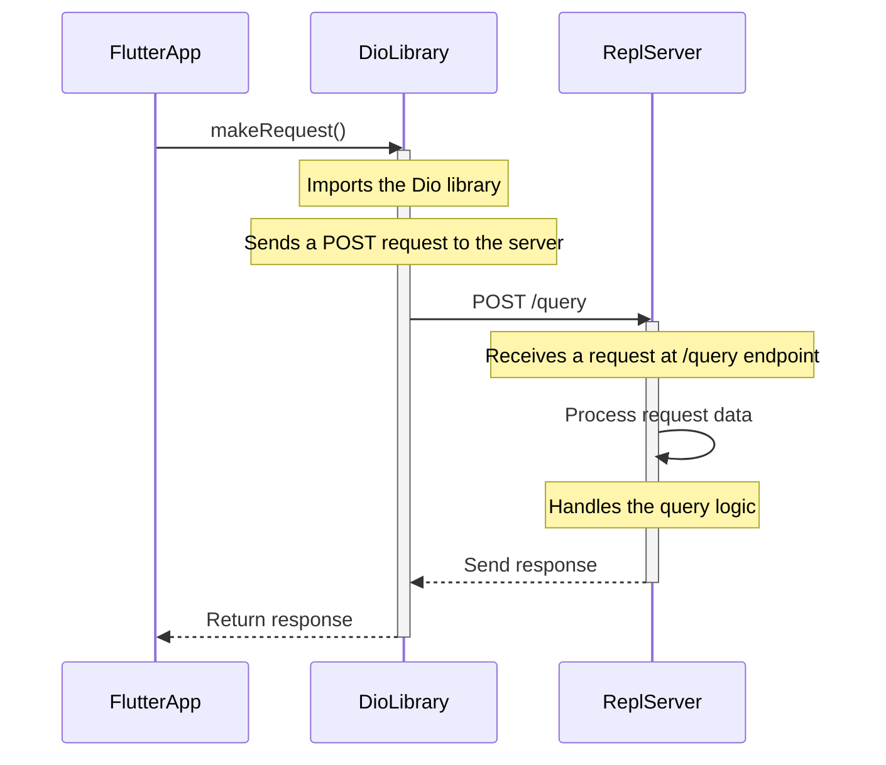
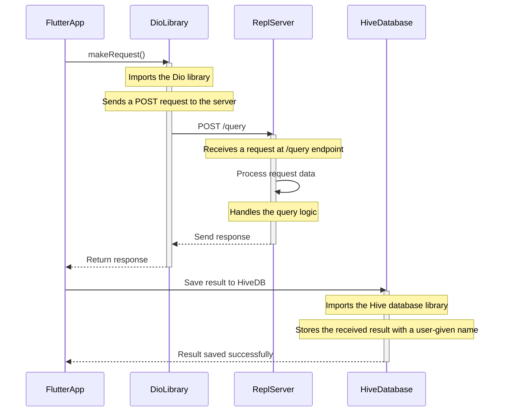

### Introduction

> **Purpose of the Document**

	This document serves as a guide for stakeholders, developers, 
	and testers involved in the Summarify project. 
	It details the application overview, user interface design, working 
	of Summarify and potential future enhancements of our application.

> **Overview of the Mobile App**

	Summarify is a mobile application designed to assist users in
	summarizing lengthy texts using BART algorithms. BART is a Large 
	Language Model algorithm which designed for sequence-to-sequence tasks
	with a particular focus on text generation and summarization. 
	By leveraging state-of-the-art natural language processing techniques, 
	the app provides users with concise and coherent summaries of input text, 
	streamlining information consumption.

## Installation

> Thank you for your interest in Summarify  the text summarization app designed exclusively for Android users. While the app is not currently available for installation, we're diligently working to bring you an exceptional experience on the Android platform.

**Developers Installation Guide**

## flutter version : 

```java
Flutter : 3.16.0
```

- Clone the Repository:

Clone the Summarify Beta repository using the following command in your terminal:

```ruby
git clone https://github.com/summarify/beta.git
```

- Navigate to the Project Directory:
  
```ruby
cd lib
```
## open the pubsec.yaml and install all the dependecies : 

```java
cupertino_icons: ^1.0.2
build_runner: ^2.4.7
dio: ^5.3.4
fluentui_system_icons: ^1.1.222
flutter_lints: ^2.0.0
gap: ^3.0.1
hexcolor: ^3.0.1
hive_flutter: ^1.1.0
hive_generator: ^2.0.1
salomon_bottom_bar: ^3.3.2
```

- open terminal window in the **main** file and run this command:
  
```ruby
flutter run --v
```

## User Interface : 

> Overview :

Summarify features a straightforward and user-friendly interface, designed to facilitate a seamless experience for users engaging in text summarization. This section provides insights into the key screens of the app.

```diff
@@ Create Workspace Screen: @@
```

> The "Create Workspace" screen in Summarify allows users to establish a dedicated workspace, enhancing organization and customization of their summarization activities.


```diff
! workspace screenshot :
```


<br>

- **Text Input Field :**

Allows users to enter the desired name for their workspace.

- **Validation Messages :**
  
Displays real-time messages to guide users through the input validation process.

- **Create Workspace Button :**

Initiates the creation of the workspace upon a user's confirmation.


```diff
@@ Home Screen : @@
```

> The home screen acts as a central hub, presenting users with an organized view of all previously saved texts.

```diff
@@ Home Screen screenshot : @@
```


- **Saved Texts List :**

1 .Displays a list of all texts previously saved by the user.
2 .button for creating new process for summarize

- **Navigation Bar :**

Provides quick access to other screens, including the text profile screen and search screen.

```diff
@@ Text Input Screen : @@
```
> This screen allows users to input text for summarization and view the generated result.

```diff
@@ Input Screen screenshot : @@
```


- **Input Text Field :**

Allows users to input or paste the text they wish to summarize.

- **Summarize Button :**

Initiates the text summarization process

- **Generated Summary :**

Displays the summarized text produced by the BART algorithm.

- **Svae Button :**

  button for saving the result from the api response

## Text Summarization Process :

> How it Works :

The text summarization process within Summarify involves leveraging BART algorithms. BART, being a state-of-the-art Large Language Model, excels in sequence-to-sequence tasks, making it ideal for text summarization. The app breaks down the summarization process into the following steps:

- **Input Text Processing :**

The user-provided text undergoes preprocessing to enhance the efficiency of the summarization algorithm.

- **BART Algorithm Execution :**

The processed text is fed into the BART algorithm using the llm api from huggingface, which generates a coherent summary.

- **Summary Presentation :**

The generated summary is presented to the user on the summary screen.

- **API Integration Code :**

> Overview :

The following code snippet demonstrates how Summarify integrates with the Language Model API (LLM API) for text summarization.

```diff
! makeRequest Function : 
```
The **makeRequest** function is responsible for making requests to the LLM API and handling the responses.

```dart
import 'package:dio/dio.dart';
import 'dart:convert';

/// Makes a request to the Language Model API (LLM API) for text summarization.
///
/// Parameters:
///   - llmText: The input text to be summarized.
///
/// Returns:
///   - A Dio [Response] object containing the API response.
Future<Response> makeRequest({
  required String llmText,
}) async {
  Dio dio = Dio();
  var url = 'endpoint here';
  var data = {
    'inputs': llmText,
  };

  try {
    Response response = await dio.post(
      url,
      data: jsonEncode(data),
      options: Options(
        headers: {
          'Content-Type': 'application/json; charset=UTF-8',
        },
      ),
    );

    return response;
  } catch (error) {
    // Handle any potential errors during the API request.
    print('Error during API request: $error');
    throw error;
  }
}

```

```diff
! Usage Example: : 
```

```dart
// Example usage of the makeRequest function
void main() async {
  try {
    String inputText = "This is the input text to be summarized.";
    Response apiResponse = await makeRequest(llmText: inputText);

    // Access the summarized text from the API response
    String summarizedText = apiResponse.data['outputs'];

    // Perform further actions with the summarized text
    print('Summarized Text: $summarizedText');
  } catch (error) {
    // Handle errors, if any
    print('An error occurred: $error');
  }
}

```

```diff
+ inner working of this process inside the summarify application : 
```



## Local Database Integration

> Overview :

The incorporation of a local database within Summarify serves as a crucial element in enhancing the app's functionality and user experience. By utilizing Hive, a lightweight NoSQL database, Summarify achieves key objectives such as data persistence, offline accessibility, improved performance, and efficient management of user preferences. This streamlined integration ensures that users can seamlessly access and manage their summarized texts and workspace information, contributing to a responsive and reliable application experience.

```diff
+ Hive Initialization : 
```

```dart

import 'package:hive/hive.dart';
import 'package:path_provider/path_provider.dart' as path_provider;

Future<void> initializeHive() async {
  final appDocumentDirectory = await path_provider.getApplicationDocumentsDirectory();
  Hive.init(appDocumentDirectory.path);
}

```

```diff
+ Opening Hive Boxes : 
```

```dart

import 'package:hive/hive.dart';

late Box<SummarizeTextSave> summarizeBox;
late Box workspaceBox;

summarizeBox = Hive.box<SummarizeTextSave>("SumResult");
workspaceBox = Hive.box('workspace');

```

```diff
+ Saving Summarized Text :
```

```dart

Future<void> saveSummarizedText(String title, String text) async {
  final summarizeBox = await openHiveBox('SumResult');
  summarizeBox.add(SummarizeTextSave(summrizeTitle: title, summarizeTextResult: text));
}

```

```diff
+ Retrieving Saved Summaries :
```

```dart

Future<List<SummarizeTextSave>> getSavedSummaries() async {
  final summarizeBox = await openHiveBox('SumResult');
  return summarizeBox.values.toList();
}

```

```diff
+ Deleting a Saved Summary :
```

```dart

Future<void> deleteSavedSummary(int index) async {
  final summarizeBox = await openHiveBox('SumResult');
  summarizeBox.deleteAt(index);
}

```

```diff
+ Usage Example in Workspace Creation :
```

```dart

class _SummaryFyWorkspaceState extends State<SummaryFyWorkspace> {
  TextEditingController contentController = TextEditingController();
  final _formValidatorKey = GlobalKey<FormState>();
  late Box workspaceBox;

  @override
  void initState() {
    super.initState();
    workspaceBox = Hive.box('workspace');
  }

  // ... (other parts of the code)

  GestureDetector(
    onTap: () {
      if (_formValidatorKey.currentState!.validate()) {
        workspaceBox.put(
          "Workspace Name",
          contentController.text,
        );
        Navigator.push(
          context,
          MaterialPageRoute(builder: (context) {
            return SummaryFyBottomNavBarController();
          }),
        );
      } else {
        ScaffoldMessenger.of(context).showSnackBar(
          SnackBar(
            content: Text("Please Fill correctly the field"),
            backgroundColor: SummaryfyColors.color_1,
            duration: Duration(
              seconds: 1,
            ),
          ),
        );
      }
    },
    child: customButton(
      // ... (other parts of the code)
    ),
  );

  // ... (other parts of the code)
}

```

```diff
! inner working of this process inside the summarify application : 
```



## User Permissions :

> Summarify may request certain permissions to provide users with a seamless and enhanced experience. Below is an outline of the permissions the app may require, along with explanations for their necessity:


```diff
! Storage Access :
```

> Permission Reason: Summarify may request access to device storage to save and retrieve summarized texts. This ensures that users can easily manage and access their saved summaries.

> How to Manage: Users can manage storage access in the device settings. Navigate to "Settings" > "Apps" > "Summarify" > "Permissions" to adjust storage permissions.


```diff
! Internet Connection : 
```

> Permission Reason: Summarify relies on an internet connection to interact with the BART algorithm and provide users with accurate text summarization.

> How to Manage: Users should ensure their device has an active and stable internet connection for optimal app functionality.


```diff
! Camera and Microphone Access : 
```

> Permission Reason: Summarify does not currently require camera or microphone access. If future updates include features that necessitate these permissions, clear explanations will be provided.

> How to Manage: Users can manage camera and microphone access in the device settings under "App Permissions."


```diff
! Device Identity and Call Information : 
```

> Permission Reason: Summarify does not request access to device identity or call information. The app's functionality does not rely on these permissions.

> How to Manage: Users can review and manage app permissions in the device settings under "App Permissions."
:

```diff
! Location Access : 
```

> Permission Reason: Summarify does not require access to user location. Location services are not used in the app's current functionality.

> How to Manage: Users can manage location access in the device settings under "App Permissions."


## Troubleshooting

> While Summarify aims to provide a seamless experience, users may encounter certain limitations or issues. Below are common scenarios and recommended solutions:


**Unsupported File or URL Content:**

```diff
- Issue: Summarify currently supports text input only and does not handle file uploads or URL scraping.
+ Solution: Ensure that the input provided is plain text. If you encounter issues,copy and paste the relevant text directly into the app.
```

**Limited Search Functionality:**

```diff
- Issue: The app's search functionality may not cover all aspects, leading to potential difficulties in finding saved texts.
+ Solution: To efficiently manage your saved texts, consider maintaining clear titles for each summarization. This will aid in easier retrieval using the existing search feature.
```

**Unsupported iOS Devices:**

```diff
- Issue: Summarify is currently available exclusively for Android users, and support for iOS devices is not yet implemented.
+ Solution: We are actively working on expanding Summarify to support iOS devices. Please stay tuned for future updates and releases.
```

**Network-Related Problems:**

```diff
- Issue: Users may experience connectivity issues or delays in the app due to network-related problems.
+ Solution:
# Ensure that your device has a stable internet connection.
# If using Summarify offline, make sure the content you want to summarize is already saved within the app.
```

**App Crashes:**

```diff
- Issue: Users may encounter app crashes, which can be caused by various factors.
+ Solution:
# Ensure you are using the latest version of Summarify from the respective app store.
# If the issue persists, uninstall and reinstall the app to resolve potential corruption.
```

**Performance Optimization:**

```diff
- Issue: Users may experience performance-related issues on older devices or devices with limited resources.
+ Solution:
# Close background applications to free up device resources.
# Ensure your device has sufficient available storage space.
```

## Future Roadmap

> At Summarify, we are committed to continuous improvement and innovation. Our future roadmap outlines upcoming features, enhancements, and releases aimed at providing users with an even more powerful and seamless text summarization experience.

```diff
+ Upcoming Features:
```

**Cross-Platform Availability :**

We're actively working on extending Summarify's support to iOS devices, ensuring a broader user base and a consistent experience across platforms.

**Advanced Summarization Techniques :**

Explore and implement advanced summarization techniques to enhance the quality and accuracy of generated summaries.

**Collaborative Workspace :**

Introduce collaborative features, allowing users to create and share workspaces with colleagues or teams, fostering a collaborative text summarization environment.

```diff
+ Enhancements :
```

**User-Interface Refinement :**

Continuously refine and optimize the user interface for an even more intuitive and aesthetically pleasing experience.

**Improved Search Functionality :**

Enhance the search functionality to provide users with more efficient ways to find and retrieve their saved texts.
